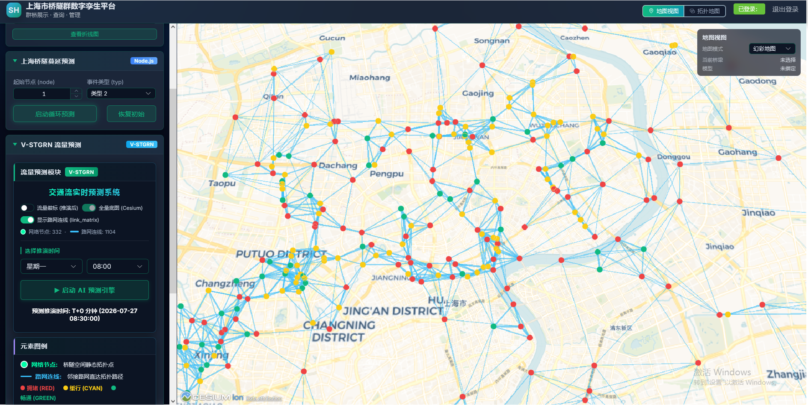

# 上海市桥隧群数字孪生平台



面向上海市约 332 座桥隧的数字孪生管理平台：Cesium 三维地图 + 路网拓扑连线 + GNN 交通流量推演 + 桥隧拥堵蔓延模型，支持 Excel 台账数据一键入库与同步。

## 技术架构

- **前端**：Vue 3 + Vite + Pinia + CesiumJS + Element Plus + ECharts
- **后端**：Node.js (Express) + JWT 鉴权
- **数据库**：PostgreSQL (+ PostGIS 可选)
- **AI 推演**：Python + PyTorch（V-STGRN 时空图网络）
- **部署**：Nginx + PM2 + 单机 PostgreSQL

## 目录结构

```
├── frontend/        # 三维展示与管理界面 (Vue 3 + Cesium)
├── backend/         # REST API 与鉴权
├── sql/             # 数据库初始化脚本（含 PostGIS 降级方案）
├── ai_models_flow/  # V-STGRN 流量预测训练/推理
├── ai_models_jam/   # 桥隧拥堵蔓延模型
└── requirements.txt # Python 依赖清单
```

---

# 环境安装指南（新机部署必读）

## 一、必备软件

| 软件 | 版本要求 | 下载地址 | 用途 |
|---|---|---|---|
| **Node.js** | ≥ 18 | https://nodejs.org/ | 前后端运行环境 |
| **Python** | 3.10 ~ 3.12 | https://www.python.org/downloads/ | AI 推演、数据导入 |
| **PostgreSQL** | ≥ 14 | https://www.postgresql.org/download/ | 业务数据库 |
| **Git** | 任意 | https://git-scm.com/ | 拉取代码 |

> Windows 安装 Python 时务必勾选 **"Add Python to PATH"**。
> PostgreSQL 安装时记住自己设置的密码，后面要填到 `.env` 里。PostGIS 为可选项，未安装也能跑通（初始化脚本会自动降级执行 `schema_nopostgis.sql`，之后补装 PostGIS 不影响继续开发）。

## 二、获取项目

```bash
git clone https://github.com/gangan-hub/shanghai_bridge_twin.git
cd shanghai_bridge_twin
```

> 国内网络访问 GitHub 缓慢时，可开启代理后执行：
> `git config --global http.proxy http://127.0.0.1:<代理端口>`

## 三、初始化数据库

1. 打开 pgAdmin 或 psql，创建数据库 `bridge_twin`（或使用下面的一键脚本自动创建）
2. 复制后端环境变量文件并按实际修改：

```bash
cd backend
copy .env.example .env    # Linux/Mac 使用 cp
```

编辑 `.env`：

```ini
PORT=3001                              # 需与前端 Vite 代理目标一致（见下文）
JWT_SECRET=replace_with_strong_secret  # 改成随机字符串
DB_HOST=127.0.0.1
DB_PORT=5432
DB_NAME=bridge_twin
DB_USER=postgres
DB_PASSWORD=你的postgres密码

# 坐标系来源（可选）：gcj02（默认）/ bd09 / wgs84
COORD_SOURCE=gcj02
```

3. 一键建库 + 导入表结构：

```bash
cd backend
npm install
npm run db:init
```

### 坐标系说明（定位偏移纠正）

Cesium 定位使用 **WGS84（经纬度）**。如果你的桥梁坐标来自：
- 高德/腾讯：通常为 `GCJ-02`
- 百度：通常为 `BD-09`

在 `backend/.env` 配置（**默认 `gcj02`**）：

- `COORD_SOURCE=gcj02`（默认，接口会把 GCJ-02 转为 WGS84）
- `COORD_SOURCE=bd09`（数据为百度 BD-09 时用，先转 GCJ-02 再转 WGS84）
- `COORD_SOURCE=wgs84`（数据已是 GPS/WGS84 时用，不做转换）

后端接口返回时会自动转换为 WGS84，用于 Cesium 定位；若记录中存在人工校准的 `wgs_lon` / `wgs_lat`，则优先使用校准值。

Excel 台账原始坐标为百度 BD-09，「同步」导入脚本会自动执行 BD-09 → GCJ-02 → WGS84 转换后入库，无需手动处理。

## 四、启动后端

```bash
cd backend
npm install
npm run dev          # 按 .env 的 PORT 监听（默认配置为 http://localhost:3001）
```

验证：浏览器打开 `http://localhost:3001/health`，看到 `bridgeCount` 大于 0 即正常。

### 启动时自动迁移

后端启动时会自动执行：

- 为 `bridges` 表补齐 `wgs_lon` / `wgs_lat`（若旧库未跑过迁移）
- 若 `bridges` 为空，自动补种 3 条示例桥梁（南浦/杨浦/卢浦）

若出现「桥梁列表 No Data」：

1. 打开 `/health` 查看 `bridgeCount` 与 `dbError`，定位连接或表结构问题
2. 执行修复脚本补种：`npm run db:repair`
3. 前端 token 过期返回 401 时重新登录即可

## 五、安装 Python 环境（AI 推演用）

在项目根目录执行：

```bash
# 1. 创建虚拟环境（Windows）
python -m venv venv
venv\Scripts\activate

# Linux / Mac:
# python3 -m venv venv && source venv/bin/activate

# 2. 安装全部 Python 依赖
pip install -r requirements.txt
```

> **PyTorch 显卡加速（可选）**：requirements.txt 安装的是 CPU 版 torch，可直接运行。
> 有 NVIDIA 显卡建议访问 https://pytorch.org 按提示安装 CUDA 版，推演速度更快。

### HTTP 请求环境自检

项目内置了统一的 requests 封装（自动代理/超时/重试），可单独自检网络：

```bash
python ai_models_flow/http_client.py
```

需要代理时通过环境变量指定：

```bash
set TWIN_HTTP_PROXY=http://127.0.0.1:65532     # Windows
export TWIN_HTTP_PROXY=http://127.0.0.1:65532  # Linux/Mac
```

## 六、启动前端

```bash
cd frontend
npm install
npm run dev           # 启动后访问 http://localhost:5173
```

前端开发服务器已配置代理：`/api` 与 `/models` 均转发到 `http://localhost:3001`，请保证后端端口一致。

## 七、AI 推演说明

- **流量预测训练**：`python ai_models_flow/main.py`（结果写入 `ai_models_flow/results/`）
- **GNN 推演**：无需单独启动服务，在前端「AI 推演」面板操作即可，后端自动调用推理脚本
- **拥堵蔓延模型**：同样由后端接口自动运行 `ai_models_jam/spread_core_shanghai.py`，无需手动启动

## 八、快速启动清单（TL;DR）

```bash
# 终端 1 —— 数据库初始化 + 后端
cd backend
copy .env.example .env      # 修改 DB_PASSWORD 等
npm install
npm run db:init
npm run dev

# 终端 2 —— 前端
cd frontend
npm install
npm run dev

# （可选）终端 3 —— Python 环境
python -m venv venv
venv\Scripts\activate
pip install -r requirements.txt
python ai_models_flow/http_client.py   # 自检网络
```

---

## 默认账号

| 角色 | 账号 | 密码 |
|---|---|---|
| 管理员 | admin | admin123 |
| 游客 | visitor | visitor123 |

## 后端核心接口

- `POST /api/auth/login`：JWT 登录（admin / visitor）
- `GET /api/bridges`：桥梁分页与筛选
- `GET /api/bridges/:id`：单桥详情
- `POST /api/bridges/spatial/search`：空间范围查询（BBox）
- `GET /api/bridges/reload_from_xlsx`：从 Excel 台账全量同步数据库（含 BD-09→WGS84 坐标转换、孤儿数据清理）
- `GET /api/models/:bridgeCode/tileset`：模型地址
- `GET /api/gnn/topology`：路网拓扑连线（link_matrix CSV 解析）
- `POST /api/gnn/inference_real`：GNN 流量推演
- `POST /api/python/start-shanghai`：拥堵蔓延推演

## 常见问题（FAQ）

**Q: pip install 很慢？**
使用国内镜像：`pip install -r requirements.txt -i https://pypi.tuna.tsinghua.edu.cn/simple`

**Q: npm install 很慢？**
使用国内镜像：`npm config set registry https://registry.npmmirror.com`

**Q: git push 连不上 GitHub？**
配置代理：`git config --global http.proxy http://127.0.0.1:<代理端口>`（端口以本机代理软件为准）

## 后续扩展

- 实时监测：增加 WebSocket + TimescaleDB
- 告警中心：规则引擎 + 通知策略
- 视频融合：摄像头流接入与联动
